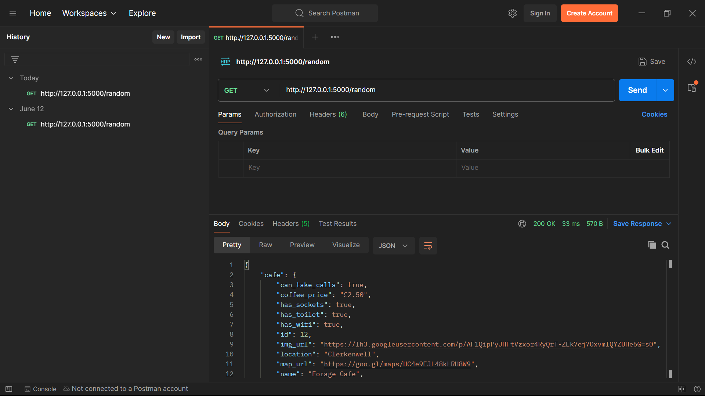

# Cafe API

Welcome to the Cafe API project! This API provides access to a database of cafes, allowing users to retrieve information about cafes, their locations, menus, and reviews.

## Project Description

The Cafe API is designed to serve as a backend service for applications that need to access and manage data related to cafes. It supports operations such as retrieving cafe details, adding new cafes, updating existing information, and managing user reviews.

## Features

- **Cafe Information**: Access detailed information about cafes, including location and contact details.
- **Menu Management**: Retrieve and update cafe menus.
- **User Reviews**: Submit and manage reviews for cafes.
- **Search and Filter**: Find cafes based on location, rating, or menu items.

## Usage

Once the API server is running, you can interact with it using HTTP requests. Below are some of the key endpoints:

### API Endpoints

- **GET /cafes**: Retrieve a list of all cafes.
- **GET /cafes/:id**: Retrieve details of a specific cafe by ID.
- **POST /cafes**: Add a new cafe to the database.
- **PUT /cafes/:id**: Update details of an existing cafe.
- **DELETE /cafes/:id**: Remove a cafe from the database.
- **GET /cafes/:id/reviews**: Retrieve reviews for a specific cafe.
- **POST /cafes/:id/reviews**: Submit a new review for a cafe.

## Images

- can use postman api, to check the api endpoints as follows.

