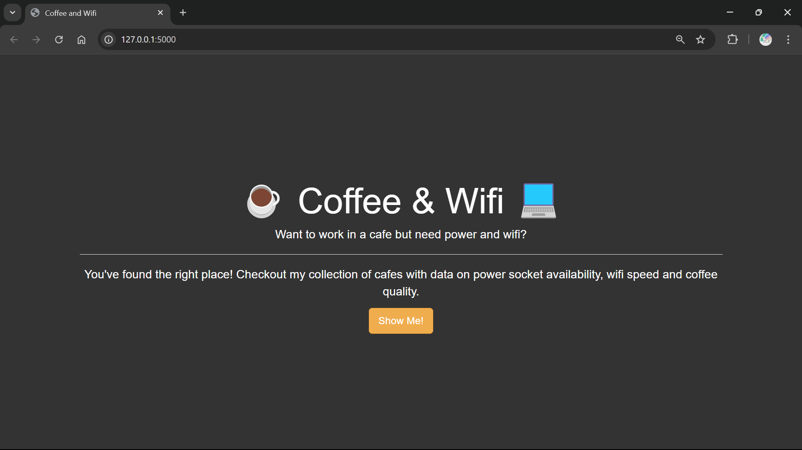
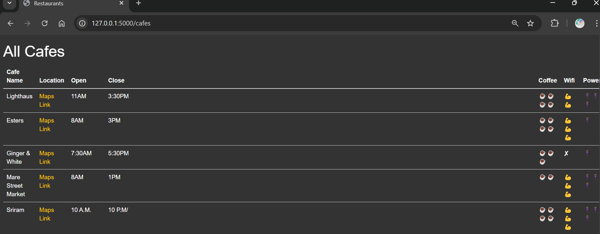
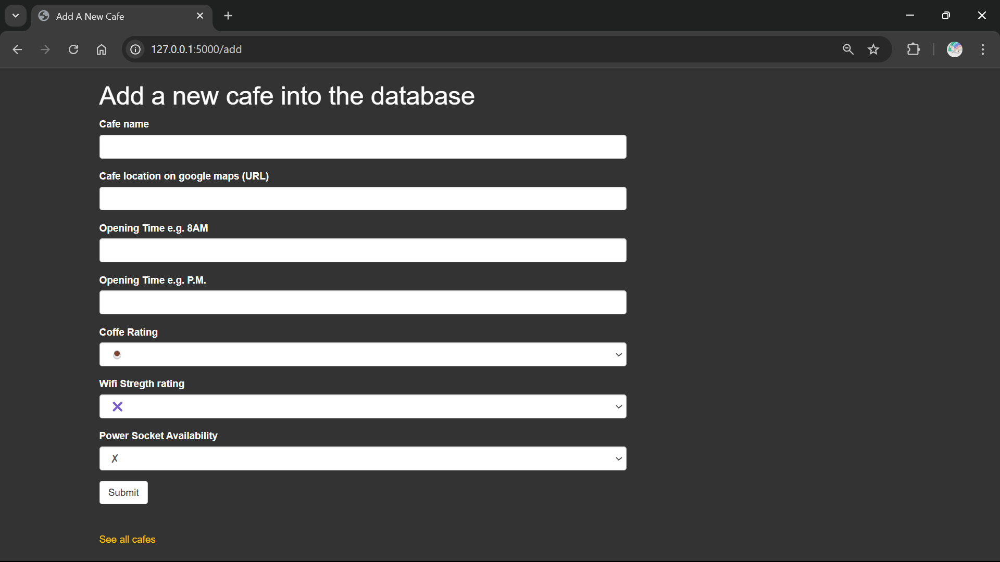

# Coffee and Wifi

Welcome to the Coffee and Wifi project! This project aims to provide a comprehensive guide and resources for finding the best coffee shops with reliable wifi.

## Project Description

The Coffee and Wifi project is designed to help remote workers, students, and coffee enthusiasts find the perfect spot to enjoy a cup of coffee while staying connected. Our curated list of coffee shops includes detailed reviews, wifi speed tests, and ambiance ratings.

## Features

- **Curated Coffee Shop List**: Discover the best coffee shops in your area.
- **Wifi Speed Tests**: Check the internet speed before you visit.
- **Ambiance Ratings**: Find the perfect atmosphere for work or relaxation.
- **User Reviews**: Read and contribute reviews from the community.

## Usage

Once the development server is running, you can access the application at `http://localhost:3000`. Explore the list of coffee shops, check wifi speeds, and read user reviews.

## Images

