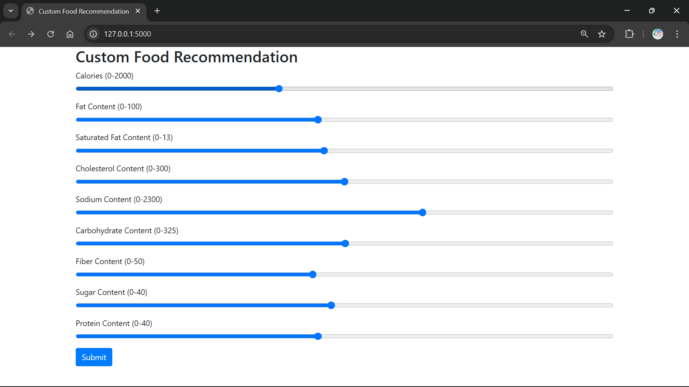
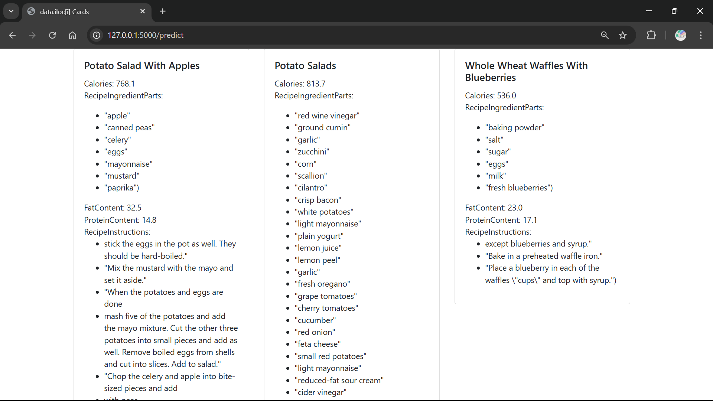

# Custom Food Recommendation System

Welcome to the Custom Food Recommendation System! This project is designed to help users find food recommendations based on their nutritional preferences.

## Project Description

The Custom Food Recommendation System is a web application that allows users to input their desired nutritional values and receive personalized food recommendations. The application uses machine learning techniques to suggest recipes that meet the specified criteria.

## Installation Instructions

1. Clone the repository:
   ```
   git clone https://github.com/Sriram-Merugu/Flask-Projects.git
   ```
2. Navigate to the project directory:
   ```
   cd Custom_Food_Recommendation_System
   ```
3. Install the required dependencies:
   ```
   pip install -r requirements.txt
   ```

## Usage Instructions

1. Start the Flask application:
   ```
   python main.py
   ```
2. Open your web browser and go to `http://localhost:5000`.
3. Use the sliders to set your desired nutritional values and click "Submit" to receive recommendations.

## Output Webpages

- Home Page: Displays the input form for nutritional values.

- Response Page: Displays the recommended recipes based on the input values.


<!-- Add any additional information or sections as needed -->
