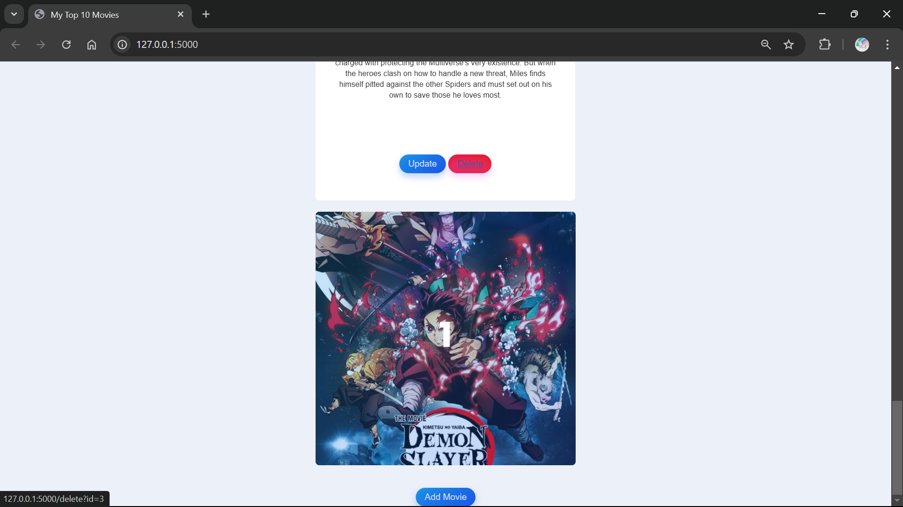
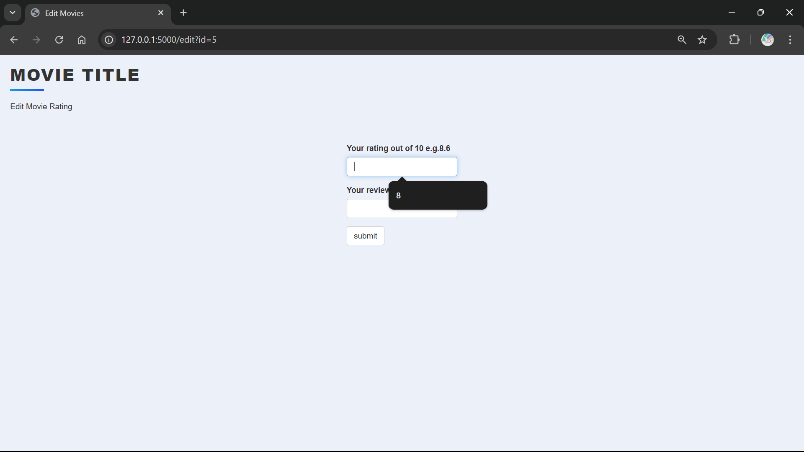
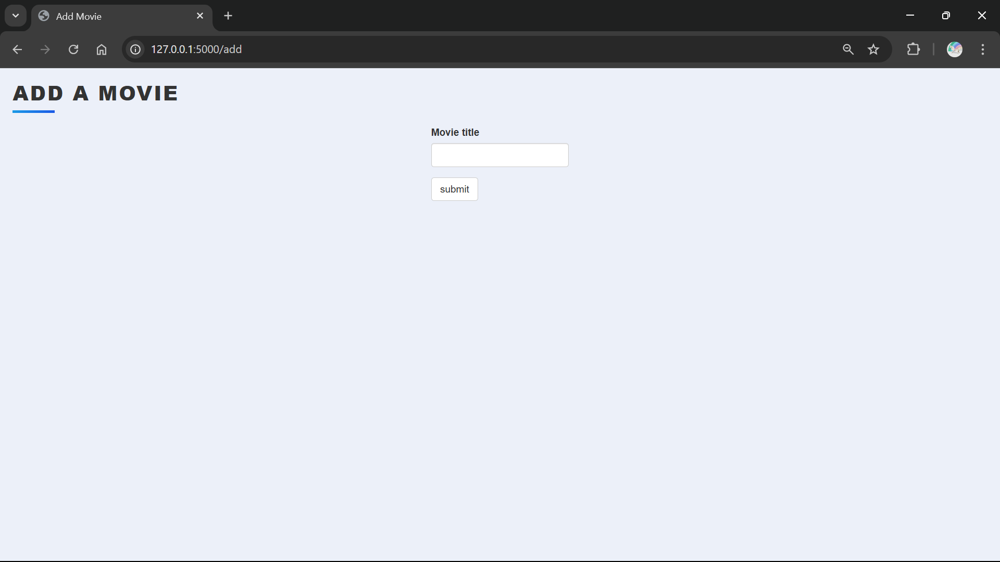
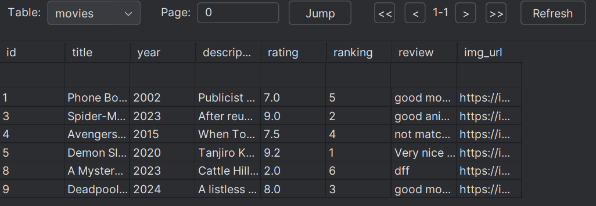

# My Movies

Welcome to the My Movies project! This project is designed to help you organize and track your personal movie collection.

## Project Description

The My Movies project is a personal movie management system that allows users to catalog their movie collection, track watched movies, and rate their favorites. It's perfect for movie enthusiasts who want to keep their collection organized and easily accessible.

## Features

- **Movie Cataloging**: Add and organize movies in your personal collection.
- **Watchlist**: Keep track of movies you plan to watch.
- **Ratings and Reviews**: Rate movies and write personal reviews.
- **Search and Filter**: Easily find movies by title, genre, or rating.

## Usage

Once the development server is running, you can access the application at `http://localhost:3000`. Begin adding movies to your collection, track your watchlist, and enjoy managing your movie library.

## Images

